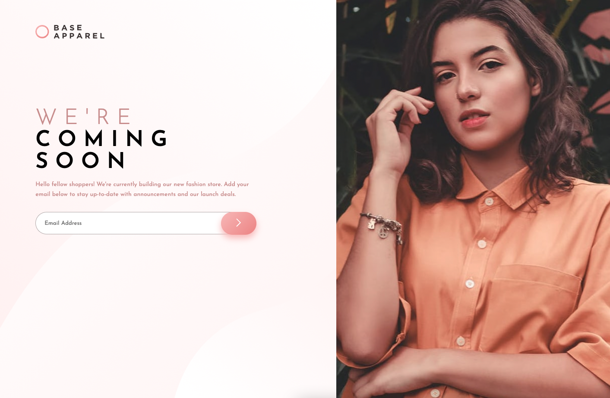

# Frontend Mentor - Base Apparel coming soon page solution

This is a solution to the [Base Apparel coming soon page challenge on Frontend Mentor](https://www.frontendmentor.io/challenges/base-apparel-coming-soon-page-5d46b47f8db8a7063f9331a0). Frontend Mentor challenges help you improve your coding skills by building realistic projects.

## Table of contents

- [Overview](#overview)
  - [The challenge](#the-challenge)
  - [Screenshot](#screenshot)
  - [Links](#links)
- [My process](#my-process)
  - [Built with](#built-with)
  - [What I learned](#what-i-learned)
  - [Continued development](#continued-development)
  - [Useful resources](#useful-resources)
- [Author](#author)
- [Acknowledgments](#acknowledgments)

## Overview

### The challenge

Users should be able to:

- View the optimal layout for the site depending on their device's screen size
- See hover states for all interactive elements on the page
- Receive an error message when the `form` is submitted if:
  - The `input` field is empty
  - The email address is not formatted correctly

### Screenshot

Desktop


Mobile


Email Validation


### Links

[Solution URL](https://github.com/ponhuang/base-apparel-coming-soon)
[Live site URL](https://ponhuang.github.io/base-apparel-coming-soon/)

## My process

### Built with

- Semantic HTML5 markup
- node-sass
- SCSS custom properties
- Flexbox
- CSS Grid
- Desktop-first workflow

### What I learned

1.) The import file order in SASS is important, put the variable on the very first top to avoide "Undefined variable".

```scss
@import "variables";
@import "base";
@import "layout";
@import "media";
```

2.) Learn how to make email validation

```js
form.addEventListener("submit", (e) => {
  // prevent form from submitting
  e.preventDefault();
  if (email.value == "") {
    errorMessage.innerText = "Email cannot be blank";
    form.classList.add("error");
    form.classList.remove("success");
  } else if (!email.value.match(regexEmail)) {
    // if regexEmail is not matched user's enter value
    errorMessage.innerText = "Please enter a valid email";
    form.classList.add("error");
    form.classList.remove("success");
  } else {
    form.classList.add("success");
    form.classList.remove("error");
  }
});
```

Regular Expression

```js
const regexEmail = /^\w+([\.-]?\w+)*@\w+([\.-]?\w+)*(\.\w{2,3})+$/;
```

<!--
^ this symbol represents beginning of input

\w this means any upperCase character, lowerCase
character, number or underscore

- means: one or more characters
  ([\.-]?\w) means, a dot '.' or hyphen '- '. ('?' means: but there must be a character after it)

* means: zero or more combinations of ([\.-]?\w)

@\w+ means: @ and one or more characters after it

(\.\w{2,3})+$ this means at the end, there must be a dot, then, 2-3 characters like .com, .eg, uk or .net

$ this represents end of the input
 -->

### Continued development

### Useful resources

- [Email Validation](https://www.youtube.com/watch?v=ouCTndDS4zk) This YouTube video help me to know how to make email validation with HTML&CSS and JavaScript

## Author

Pon Huang

[Intagram](https://www.instagram.com/une.tw)
[Art Blog](https://une722.wordpress.com)

## Acknowledgments

Thanks [Ahmed](https://www.frontendmentor.io/profile/Ahmed96Mah) for helping the design issues and also provide explanation of Email Validation.
